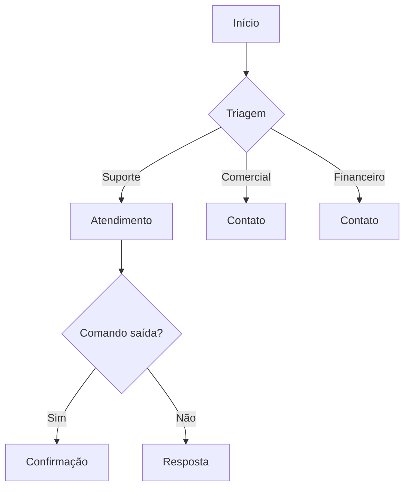

# Documentação Técnica - Nunes Chat v2.2

## 📊 Sistema de Logs
- Arquivos diários em `logs/nunes_chat_YYYYMMDD.log`
- Formato: `TIMESTAMP - LEVEL - MESSAGE`
- Tipos de registros:
  - INFO: Interações normais
  - ERROR: Exceções e falhas

## 🔄 Fluxo de Atendimento


## 🛠️ Estrutura de Arquivos
```
nunes_chat/
├── app.py                # Ponto de entrada
├── config.py             # Configurações
├── handlers/             # Lógica de atendimento
├── utils/                # Utilitários
│   ├── logger.py         # Sistema de logs
├── logs/                 # Arquivos de log
├── base_suporte.txt      # Base de conhecimento
└── documentacao          # Documentação do projeto
```

## 🚀 Integração Futura (WhatsApp)
1. Os logs serão essenciais para monitorar conversas
2. A base de conhecimento será reutilizada

## 📝 Melhorias Planejadas
- Histórico de conversas
- Análise de sentimentos
